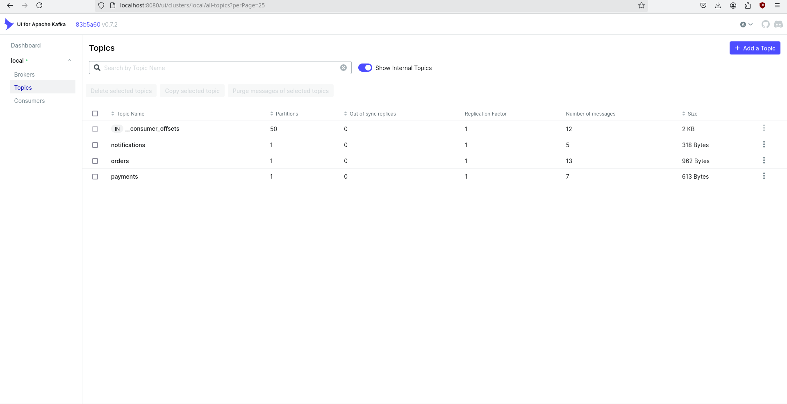
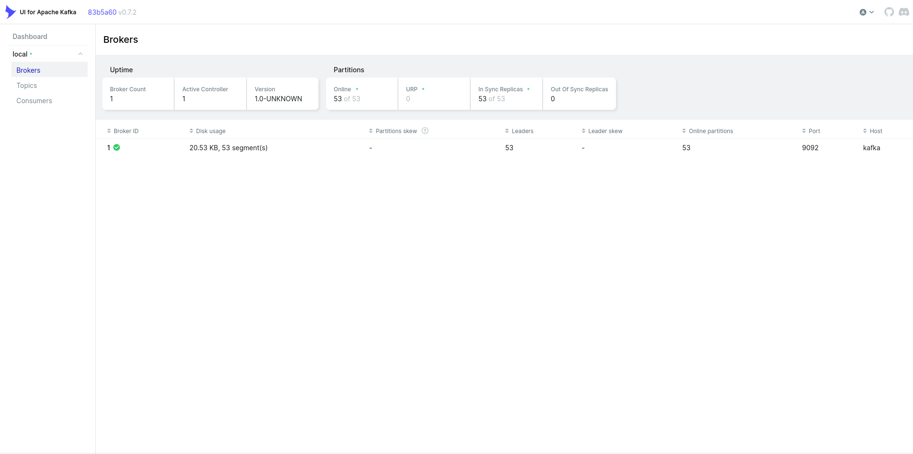
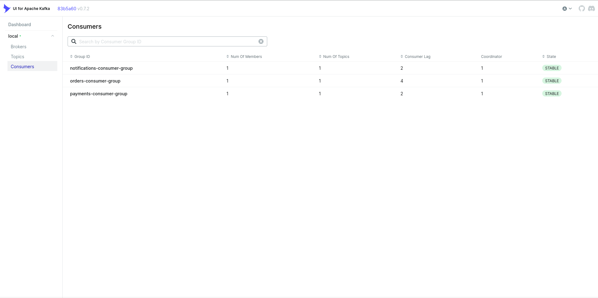
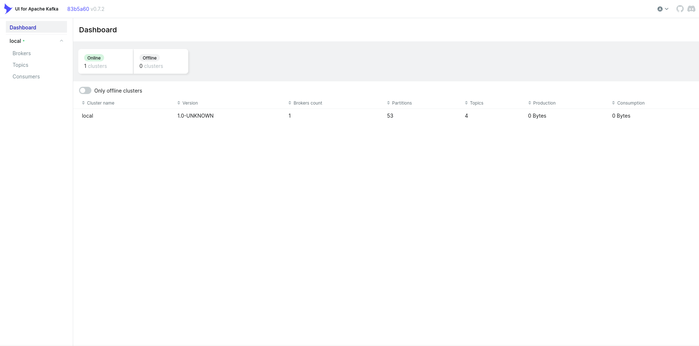

# Kafka Docker Demo Stack

## 📌 Overview
This project demonstrates a simple **event-driven architecture** using Apache Kafka, Docker, and Python.  
It includes multiple producers and consumers communicating through Kafka topics, with a Kafka UI for monitoring.

---

## 🏗️ Architecture
- **Kafka Broker** → central message hub
- **Kafka UI** → web interface to monitor topics and consumer groups
- **Producers**:
  - `orders-producer` → generates random order events
  - `payments-producer` → generates random payment events
  - `notifications-producer` → generates random user notifications
- **Consumers**:
  - `orders-consumer` → listens to the `orders` topic
  - `payments-consumer` → listens to the `payments` topic
  - `notifications-consumer` → listens to the `notifications` topic

---

## 🚀 How to Run
1. Clone the repo:
   ```bash
   git clone git@github.com:ArtyomGurevich/kafka-docker-demo.git
   cd kafka-docker-demo
   ```

2. Start the stack:
   ```bash
   docker compose up -d --build
   ```

3. Open Kafka UI:
   
   Visit http://localhost:8080
   
   - Check topics (orders, payments, notifications)
   - View consumer groups and message flow

---

## 📊 Demo
- Producers continuously send random JSON messages into their topics.
- Consumers read and print messages in real time.
- Kafka UI shows:
  - Topic message counts increasing
  - Active consumer groups
  - Internal topic `__consumer_offsets` tracking consumer progress

---

## 🛠️ Skills Demonstrated
- Docker Compose orchestration
- Kafka basics (topics, producers, consumers, consumer groups)
- Healthchecks and service dependencies
- Debugging container issues (mounts, logs, race conditions)
- End‑to‑end event pipeline visibility

---

## 🔮 Future Improvements
- Add monitoring (Prometheus + Grafana)
- Deploy with Terraform or GitOps
- Implement retry logic in producers
- Showcase consumer lag and scaling

---

## 📸 Screenshots

### Kafka Topics


### Kafka Brokers


### Kafka Consumers


### Kafka Dashboard


---

## 👤 Author
Built by José — aspiring DevOps/Cloud engineer.  
This project is part of a portfolio demonstrating hands‑on infrastructure and automation skills.
